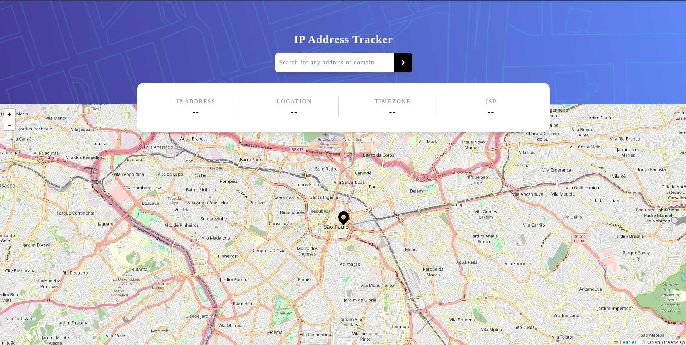

# 🌐 IP Address Tracker

Aplicação web para rastrear endereços IP e visualizar suas localizações geográficas em um mapa interativo, usando **React**, **Leaflet** e a **API do IPify**.

---

## 🖼️ Preview



## 🚀 Funcionalidades

- 🔍 Buscar qualquer IP (ex: `8.8.8.8`)
- 📍 Exibir informações detalhadas:
  - IP
  - Localização (cidade, estado, CEP)
  - Fuso horário (timezone)
  - Provedor de internet (ISP)
- 🗺️ Mapa interativo com marcador na posição do IP retornado
- 🎯 Centralização automática do mapa a cada nova busca

---

## 🛠️ Tecnologias Utilizadas

- [React](https://reactjs.org/)
- [Vite](https://vitejs.dev/)
- [TypeScript](https://www.typescriptlang.org/)
- [Tailwind CSS](https://tailwindcss.com/)
- [Leaflet](https://leafletjs.com/) + [React Leaflet](https://react-leaflet.js.org/)
- [IPify Geo API](https://geo.ipify.org/)

---

## 📦 Instalação e uso local

### 1. Clone o repositório

```bash
git clone https://github.com/seu-usuario/ip-tracker.git
cd ip-tracker
```

### 2. Instale as dependências

```bash
npm install
```

### 3. Configure a variável de ambiente

Crie um arquivo `.env` na raiz do projeto e adicione sua chave da API IPify:

```
VITE_GEO_API_KEY=sua_api_key_aqui
```

> Você pode obter uma chave gratuita em: https://geo.ipify.org/

### 4. Inicie o servidor de desenvolvimento

```bash
npm run dev
```

Abra no navegador: [http://localhost:5173](http://localhost:5173)

---

## 📁 Estrutura de Pastas

```
src/
├── images/       # Ícones e assets (flecha, marcador, etc)
├── App.tsx       # Componente principal
├── index.css     # Estilos (Tailwind CSS)
├── main.tsx      # Ponto de entrada da aplicação
```

---

## 🔎 IP de exemplo para teste

Se quiser testar rapidamente a aplicação, use este IP:

```
8.8.8.8
```

📌 Esse é um IP público do Google DNS, e sempre retorna uma localização válida.

Você também pode usar:

```
google.com
```

---

---

---

## ✅ Melhorias futuras

- [ ] Validação de IP/domínio digitado
- [ ] Animação de carregamento
- [ ] Histórico de buscas
- [ ] Suporte a modo escuro

---

## 👨‍💻 Autor

Desenvolvido por **Eduardo Hill Fávero**

- [LinkedIn](www.linkedin.com/in/eduardo-hill-fávero)
- [GitHub](https://github.com/EduardoHill)
